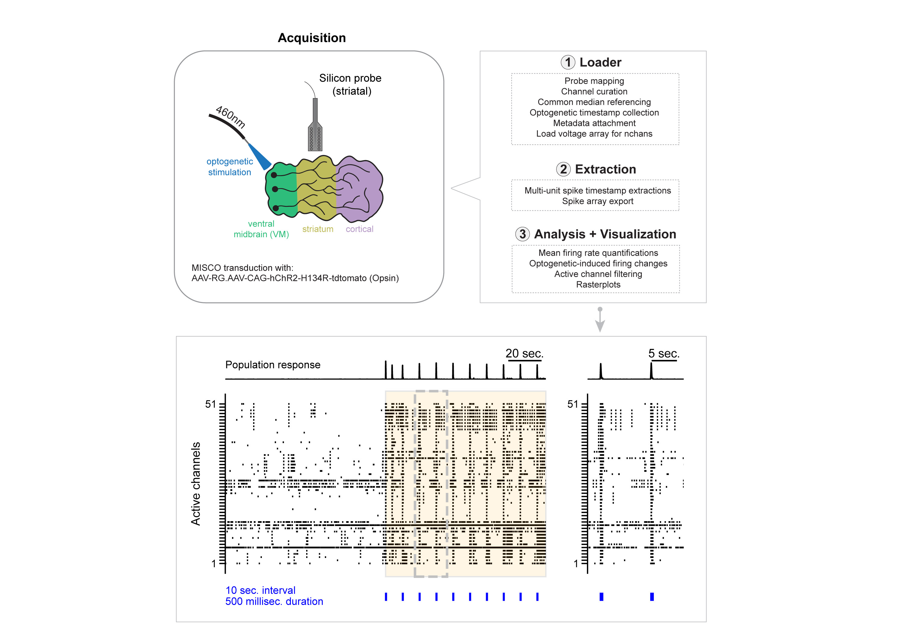

# <center> &nbsp;[](https://twitter.com/Knoblich_lab)   </center>


ventral midbrain-striatum-cortical organoid (MISCOs) electrophysiology
=======================================================================

Electrophysiology analysis on extracellular recordings from fusion ventral midbrain-striatum-cortical organoid (MISCOs) models pre- and post-optogenetic stimulation using a P-type probe (ASSY-77 P-2) from [Cambridge Neurotech](https://www.cambridgeneurotech.com/pixel-probes?utm_term=neuropixel&utm_campaign=NeuroPixels+2.0&utm_source=adwords&utm_medium=ppc&hsa_acc=8365614329&hsa_cam=11517081519&hsa_grp=111763579585&hsa_ad=593533641495&hsa_src=g&hsa_tgt=kwd-1001198336097&hsa_kw=neuropixel&hsa_mt=b&hsa_net=adwords&hsa_ver=3&gclid=CjwKCAiAp7GcBhA0EiwA9U0mtiRtHxqX5PDwZKCQ_4nKyEPJwtORKUvls1jFSwhswCVuVjR-oIVdnBoCDnQQAvD_BwE).

Optogenetic stimulation was conducted using the open-source device, [Pulse Pal](https://open-ephys.org/pulsepal). Recordings were acquired using the [Open Ephys](https://open-ephys.org/) GUI. 

Paper Abstract 
--------

Ventral midbrain dopaminergic (mDA) neurons innervate the basal ganglia- particularly the striatum- as well as the cortex and are involved in movement control and reward-related cognition. In Parkinson’s disease (PD), nigrostriatal mDA neurons degenerate and cause PD-typical motor-related impairments, while the dysfunction of mesocorticolimbic mDA neurons is implicated in addiction and neuropsychiatric disorders. Studying the development and neurodegeneration of the human dopaminergic system is therefore broadly relevant but has been limited for lack of an appropriate model. Animal models do not faithfully recapitulate the human dopaminergic system and access to human material is limited. Here, we present a human in vitro model that recapitulates key aspects of dopaminergic innervation of the striatum and cortex. We offer methods where these spatially arranged ventral midbrain-striatum-cortical organoids (MISCOs) are used to study DA neuron maturation, innervation and function with implications for cell therapy and addiction research. We detail protocols for growing VM, striatal and cortical organoids and describe how they fuse in a linear manner when placed in custom embedding molds. We report the formation of functional long-range dopaminergic connections to striatal and cortical tissues in linear assembloids and demonstrate that PSC-derived VM-patterned cells can integrate into the tissue. We successfully study dopaminergic circuit perturbations and show that chronic cocaine treatment caused long-lasting morphological, functional, and transcriptional changes that persisted upon drug withdrawal. Our method opens new avenues to investigate human dopaminergic cell transplantation and circuitry reconstruction as well as the effect of drugs on the human dopaminergic system. 

General workflow
--------
The general pipeline can be compartmentalized into 3 major components: loader, extraction and anaysis + visualization. A simplified schematic can be found below. 

All multi-unit spike-related tasks can be performed through the main class, ```FusedOrgSpikes```. A quickstart code example can be found below for the analysis. 



Quickstart
-------- 

**return mua spike times**
```python
from fused_org_ephys import FusedOrgSpikes

# set path to metadata
metadata_path = pathlib.PurePath('tests', 'test_data', 'metadata', 'metadata_test.xlsx')

# initiate class to analyse MUA across the entire recording length
muaspikes = FusedOrgSpikes(metadata_path = metadata_path, time_range = [0, None])

# return spike array 
mua_data = muaspikes.get_mua_spikearr(expID = ['test_rawfile']) 

# return mua spike times 
mua_spiketimes = muaspikes.mua_spikes
```

**return calcium imaging peaks**
```python
from fused_org_ephys import FusedOrgCa

# set path to processed trace with CaImAn
ca = FusedOrgCa(traces_fname='tests/test_data/gcamp/test_traces.pickle')

# return the calcium peak df
ca_peak_df = ca.return_caspikewidth_df()
```

Development version
--------

To get the current development version in one of your environments, first clone this repository:

```
git clone https://github.com/mzabolocki/fusion_org_ephys
cd fusion_org_ephys
pip install -r requirements.txt
pip install -r requirements_dev.txt
```

or alternatively: 

```
git clone https://github.com/mzabolocki/fusion_org_ephys
cd fusion_org_ephys
pip install -e .
```

Dependencies
--------

All analysis and figure codes are written in Python, and requires Python >= 3.9 to run. 
They have the following dependencies: 

- [numpy](https://github.com/numpy/numpy)
- [scipy](https://github.com/scipy/scipy) >= 0.19
- [pandas](https://github.com/pandas-dev/pandas)
- [matplotlib](https://github.com/matplotlib/matplotlib)
- [tqdm](https://github.com/tqdm/tqdm)
- [scikit-learn](https://github.com/scikit-learn/scikit-learn)
- [spikeinterface](https://github.com/SpikeInterface/spikeinterface)

It is recommended that [Anaconda](https://www.anaconda.com/distribution/) distribution is used to manage these requirements.

Tests were performed for ubuntu, windows and mac operating systems.

Virtual environment set-up
---------
For development version, you can set-up a venv using the following example:

**for macos**
```
python3 -m venv miscos_ephys_venv 
source miscos_ephys_venv/bin/activate

pip install -r requirements.txt
pip install -r requirements_dev.txt
```

Paper Reference
---------

Please reference the paper via the following citation:

```
Daniel Reumann (1,2), Christian Krauditsch (1), Maria Novatchkova (1), Edoardo Sozzi (3), Sakurako Nagumo Wong (1,2), Michael Zabolocki (4,5), Marthe Priouret (1), Balint Doleschall (1,2), Kaja I Ritzau-Reid (6), Marielle Piber (1,7), Ilaria Morassut (1,8), Charles Fieseler (9), Alessandro Fiorenzano (3), Molly M Stevens (6), Manuel Zimmer (9), Cedric Bardy (4,5), Malin Parmar (3), Jürgen A Knoblich (1, 10)*

1. Institute of Molecular Biotechnology (IMBA) of the Austrian Academy of Sciences, Vienna BioCenter (VBC), Vienna, Austria
2. Vienna BioCenter PhD Program, Doctoral School of the University of Vienna and Medical University of Vienna, Vienna, Austria
3. Department of Experimental Medical Science, Developmental and Regenerative Neurobiology, Wallenberg Neuroscience Center, Lund Stem Cell Center, Lund University, Lund, Sweden
4. South Australian Health and Medical Research Institute (SAHMRI), Laboratory for Human Neurophysiology and Genetics, Adelaide, SA, Australia
5. Flinders Health and Medical Research Institute, Flinders University, Adelaide, SA, Australia
6. Department of Materials, Department of Bioengineering, Institute of Biomedical Engineering, Imperial College London, SW7 2AZ London, UK
7. Current Affiliation: Zebrafish Neurogenetics Unit, Institut Pasteur, Paris, France
8. Current Affiliation: Department of Basic Neurosciences, Faculty of Medicine, University of Geneva, Geneva, Switzerland
9. Department of Neuroscience and Developmental Biology, University of Vienna, Vienna, Austria
10. Department of Neurology, Medical University of Vienna, Vienna, Austria
*Correspondence to: juergen.knoblich@imba.oeaw.ac.at
```

Analysis 
--------

An example notebook is shown for the following: 

[MUA spike extractions](https://github.com/mzabolocki/miscos_ephys/blob/main/analysis/mua_spikes/mua_spikes.ipynb): 
> 1. binary file loading and preprocessing
> 2. mua spike extractions
> 3. metadata attachment
> 4. feature quantifications (e.g. mean firing rates)
> 5. raster plot generations

[gCAMP peak finding](https://github.com/mzabolocki/miscos_ephys/blob/main/analysis/gcamp/gcamp_detect.ipynb): 
> 1. example notebook for calcium-event peak finding

Figures
--------
All notebooks used for figure generations were using data processed with analysis pipelines, and can be found [here](https://github.com/mzabolocki/miscos_ephys/blob/main/figures). 


Code contributors
-----------
Michael Zabolocki
Marthe Priouret 
Daniel Reumann
Charles Fieseler 

